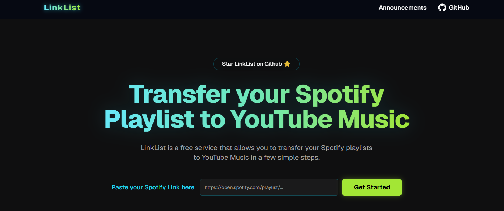

<div align="center">


# **LinkList**


[](https://react.dev/)
[](https://flask.palletsprojects.com/)

**The ultimate tool to migrate your Spotify playlists to YouTube Music.**

[Features](#-features) •
[Quick Start](#-quick-start) •
[Tech Stack](#-tech-stack) •
[CLI Mode](#-cli-self-hosting) •
[License](#-license)

</div>

---

# 🚀 Overview



**LinkList** is a robust, open-source web application designed to seamlessly transfer your music library from Spotify to YouTube Music.

Forget about manual searching — LinkList automates the process, matching your tracks with high accuracy and creating a new playlist in your YouTube Music account in minutes.

> **Note:** This project features a Neon-Minimalist UI, a robust Flask backend with concurrency support, and a dedicated CLI tool for power users.

---

# ✨ Features

- 🎨 **Modern UI:** Fully responsive, Neon aesthetic interface built with React, Tailwind CSS, and Radix UI.
- ⚡ **Fast & Concurrent:** Backend optimized to handle multiple users simultaneously using temporary authentication sessions.
- 🛡️ **Robust Error Handling:** Smart matching algorithms that handle Chrome header compression and search failures gracefully.
- 📱 **Mobile Ready:** Responsive design for desktop, tablet, and mobile.
- 💻 **CLI Mode included:** Includes a `selfhost.py` script for terminal lovers or large playlist migrations (no timeouts).
- 🔒 **Secure:** No storage of user credentials. Auth files are ephemeral.

---

# 🛠 Tech Stack

## **Frontend**

- **Framework:** React 18 + Vite
- **Language:** TypeScript
- **Styling:** Tailwind CSS + Tailwind Animate
- **Components:** Radix UI (Headless) + Lucide React (Icons)
- **State:** React Context API

## **Backend**

- **Server:** Python 3 + Flask
- **Production:** Gunicorn
- **APIs:** `ytmusicapi` (YouTube Music) + `spotipy` / `requests` (Spotify)
- **Validation:** Regex & Error Logging

---

# 🎯 Quick Start

Run LinkList locally following these steps.

---

## **Prerequisites**

- Node.js **18+**
- Python **3.9+**
- A **Spotify Developer Account** (Client ID & Secret)

---

## **1️⃣ Backend Setup**

```bash
cd backend
```

Create a virtual environment (optional but recommended):

```bash
python -m venv venv
# Windows
venv\Scripts\activate
# Mac/Linux
source venv/bin/activate
```

Install dependencies:

```bash
pip install -r requirements.txt
```

Create a `.env` file inside `/backend`:

```env
PORT=8080
FRONTEND_URL=http://localhost:5173

SPOTIPY_CLIENT_ID=your_spotify_client_id_here
SPOTIPY_CLIENT_SECRET=your_spotify_client_secret_here
```

Start the server:

```bash
# Development
python main.py

# Production (Linux/Mac)
gunicorn -c config/gunicorn.conf.py main:app
```

---

## **2️⃣ Frontend Setup**

```bash
cd frontend
npm install
```

Create a `.env`:

```env
VITE_API_URL=http://localhost:8080
```

Start the dev server:

```bash
npm run dev
```

Open: **[http://localhost:5173](http://localhost:5173)**

---

# 💻 CLI Self-Hosting (Power Users)

For extremely large playlists (500+ tracks), browsers may timeout.
Use the included **CLI tool**:

```bash
cd backend
python selfhost.py
```

The script stores sessions in `browser.json` to avoid repeating header extraction.

---

# 🤝 Contributing

1. Fork the repository

2. Create your feature branch:

   ```bash
   git checkout -b feature/AmazingFeature
   ```

3. Commit your changes:

   ```bash
   git commit -m "Add some AmazingFeature"
   ```

4. Push the branch:

   ```bash
   git push origin feature/AmazingFeature
   ```

5. Open a Pull Request.

---

# 📄 License and Copyright

**LinkList** is a heavily modified fork of [SpotTransfer](https://github.com/Pushan2005/SpotTransfer).

- **Copyright © 2025 Edvin:** UI/UX Redesign, Frontend Architecture (React/Tailwind), Backend Refactoring (Async/Threading), CLI Tool implementation.
- **Copyright © 2024 Pushan2005:** Original concept and initial API integration logic.

This project is licensed under the **GNU General Public License v3.0**.

---

### ⚡ Why use LinkList?

Unlike other tools that hit rate limits or require subscriptions, LinkList is designed for performance and freedom:

- **Concurrency:** Handles multiple users without crashing thanks to ephemeral auth sessions.
- **Smart Matching:** Enhanced search algorithm that finds songs even with slightly different metadata.
- **Chrome Ready:** Fixes the common "header compression" bug found in other transfer tools.
- **CLI Mode:** Includes a powerful terminal script for migrating massive libraries (1000+ songs) without browser timeouts.

---

<div align="center">

<p align="center">
  Developed with ❤️ by 
  <a href="https://github.com/edvincodes" target="_blank" rel="noopener noreferrer">
    <strong>Edvin</strong>
  </a>
</p>

</div>
